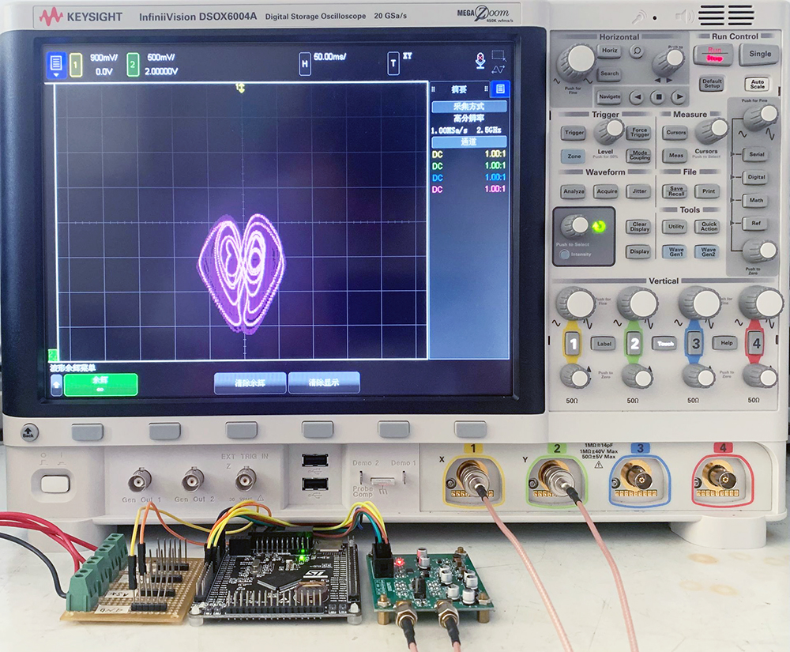
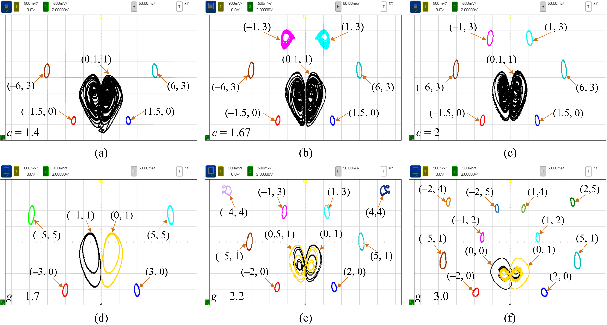

# Microcontroller-based hardware implementation

## Introduction
The microcontroller hardware platform includes one 32-bit microcontroller (STM32F407VET6), one 16-bit digital-to-analog converter (DAC8563), and some peripheral circuits.

## Method
According to the mathematical expression of the ASN model, the discrete-time ASN model is obtained using fourth-order Runge-Kutta algorithm along with the iteration step length h = 0.01, which is programmed with C language and uploaded to the microcontroller chip. All the control parameters and initial conditions are set in advance and the results generated by the hardware platform are tested by digital oscilloscope.

## Result
The experimental results are as follows:

Microcontroller hardware platform and its digital oscilloscope test result.

For different values of c or g, the phase portraits of the coexisting multiple attractors acquired by the microcontroller hardware platform with different initial conditions, where B = 2 **a** the coexistence of five attractors at c = 1.4 and g = 2 **b** the coexistence of seven attractors at c = 1.67 and g = 2 **c** the coexistence of seven attractors at c = 2 and g = 2 d the coexistence of six attractors at c = 1.8 and g = 1.7 **e** the coexistence of ten attractors at c = 1.8 and g = 2.2 **f** the coexistence of twelve attractors at c = 1.8 and g = 3.0.